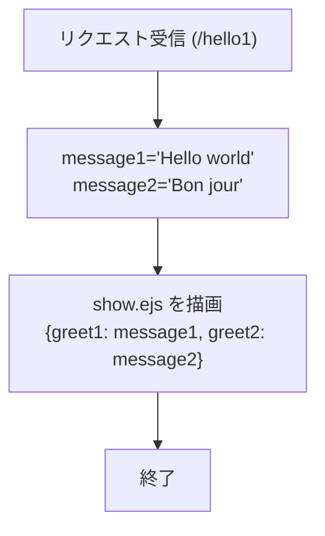
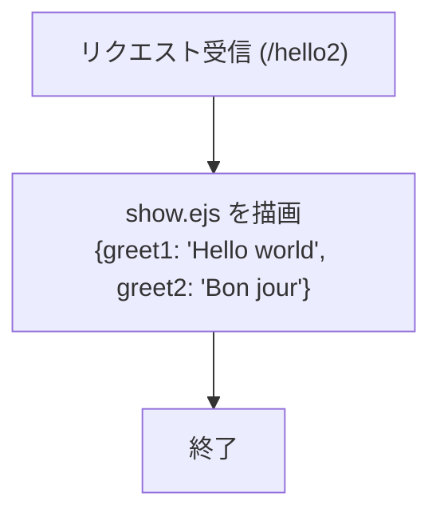
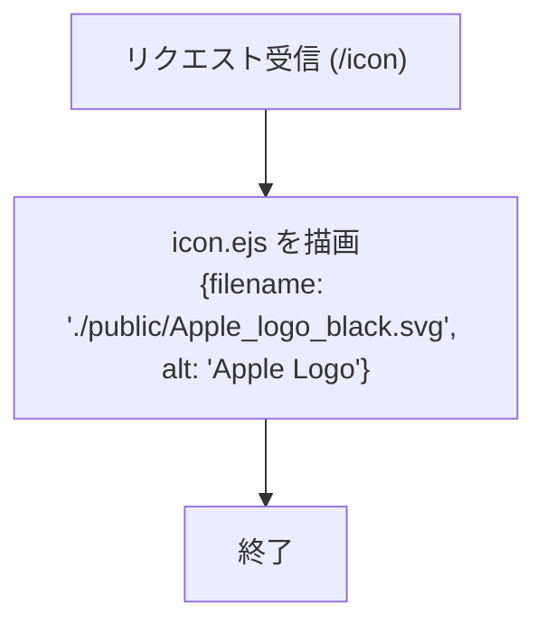
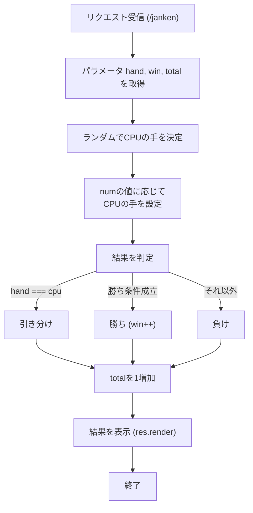
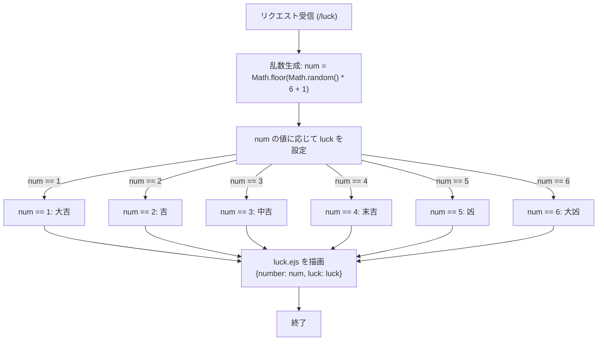
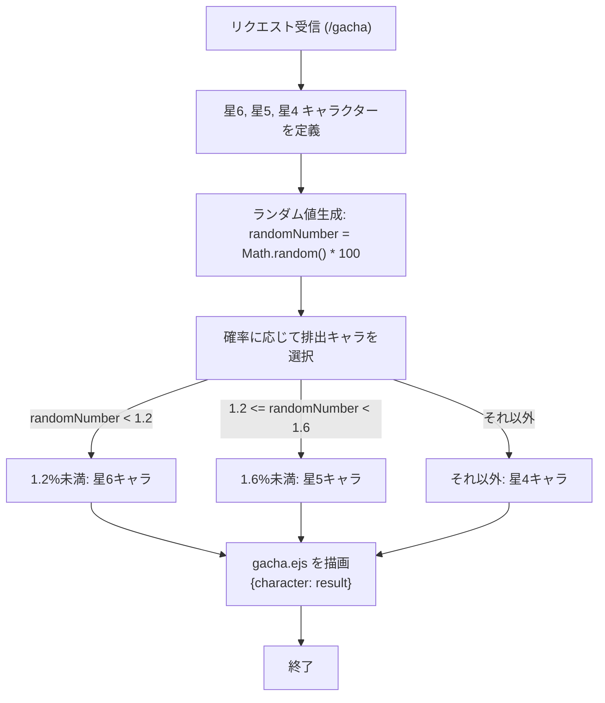

# app5.jsの説明

### ファイル一覧

ファイル名|説明
-|-
app5.js | プログラム本体
viwes/show.ejs | /hello1と/hello2のメッセージ表示
views/icon.ejs | アイコンの表示
views/janken.ejs | じゃんけんの開始画面
views/luck.ejs | おみくじ開始画面
views/gacha.ejs | ガチャ開始画面

#### 起動方法
1. ターミナルで```node app5.js```を起動する
1. Webブラウザで```localhost:8080/(上記のファイル名)```にアクセスする
1. ユーザーが自らの手で入力

#### Gitでの管理
1. ターミナルを起動する
1. ```git add .```
1. ```git commit -am 'コメント'```
1. ```git push```

上記の方法でGithabに保存及び管理を行う

#### 機能の説明
1. /hello1と/hello2のHelloメッセージの表示
・説明
それぞれ異なる形式で「Hello」と「Bon　Jour」を表示する
・使用手順
/hello1では```http://localhost:8080/hello1```に，/hello2では```http://localhost:8080/hello2```にアクセスする．/hello1と/hello2は同じメッセージが表示されるが，/hello2は文字列を直接テンプレートに渡している．

1. /iconのアイコンの表示
・説明
Appleロゴ画像を表示する．
・使用手順
```http://localhost:8080/icon```にアクセスすることで，```icon.ejs```テンプレートを使用してAppleのロゴを表示する．

1. /jankenのじゃんけんゲーム
・説明
ユーザーの手（グー，チョキ，パー）とコンピューターの手でじゃんけんを行う．勝敗と合計数がカウントされる．
・使用手順
```http://localhost:8080/janken```にアクセスし，グー，チョキ，パーを送信する．また，winとtotalのパラメターを使用することで，現在の勝数と合計試合を継続できる．結果はjanken.ejsテンプレートを通じて表示され，ユーザーの手・コンピュターの手・判定結果が出力される．

1. /luckのおみくじ
・説明
大吉から大凶まで6種類の運勢がランダムに表示される．
・使用手順
```http://localhost:8080/luck```にアクセスするだけで結果が表示される．luck.ejsテンプレートを使用して運勢と番号が出力される.

1. /gachaのガチャ機能
・説明
1.2%の確率で星6キャラクター，0.4%の確率で星5キャラクター，それ以外で星4キャラクターを取得できるガチャである．
・使用手順
```http://localhost:8080/gacha```にアクセスするだけでガチャの結果が表示される．gacha.ejsテンプレートを使用し，キャラクター名が表示される．
#### フローチャート
##### /hello1と/hello2のフローチャート



##### /iconのフローチャート

##### /jankenのフローチャート

##### /luckのフローチャート


##### /gachaのフローチャート




